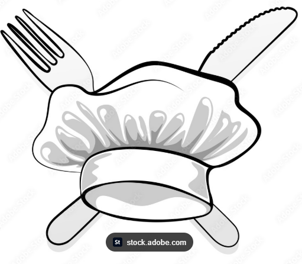
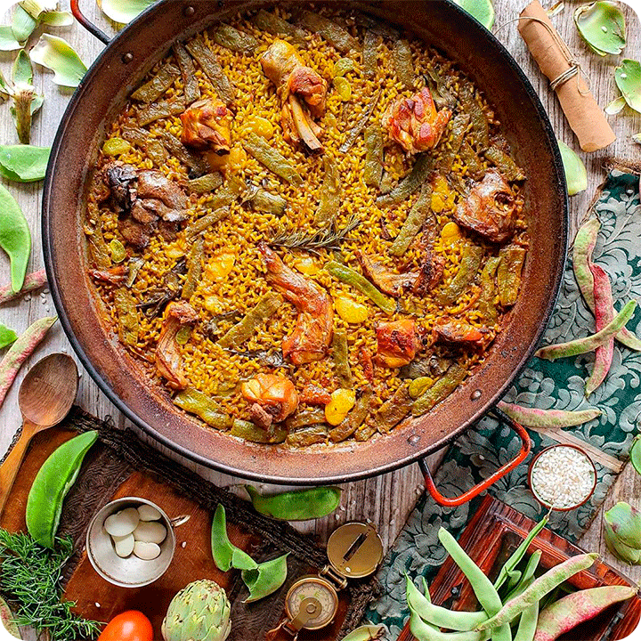
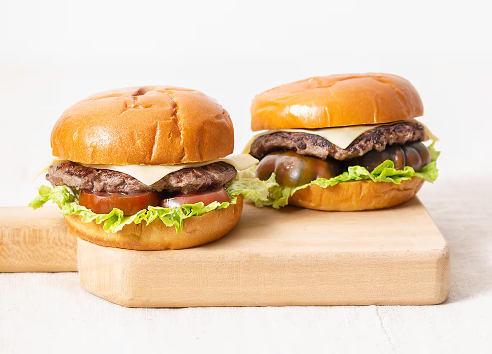
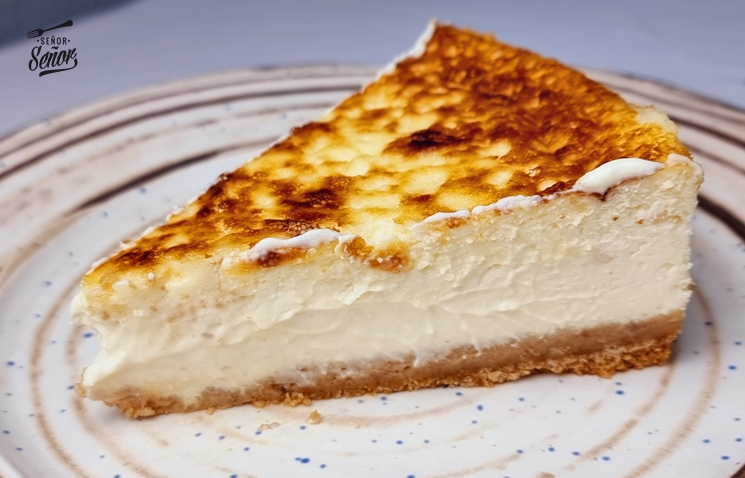

# Reporte de proyecto

## Estructura del proyecto

```
/home/AlexCS/Documents/GitHub/Proyecto-3-trimestre
├── README.md
├── admin.php
├── chefika_db.sql
├── conexion.php
├── css
│   └── style.css
├── editar.php
├── editar_reserva.php
├── footer.php
├── header.php
├── idioma.php
├── imgs
│   ├── 1774351543_hot-dog.jpg
│   ├── chef.jpg
│   ├── gorro-chef.png
│   ├── plato1.jpg
│   ├── plato2.jpg
│   └── plato3.jpg
├── index.php
├── lenguajes.php
├── login.php
├── logout.php
├── menu.php
└── reserva.php
```

## Código (intercalado)

# Proyecto-3-trimestre
**README.md**
```markdown
# Proyecto-3-trimestre
```
**admin.php**
```php
<?php
session_start();
if (!isset($_SESSION['admin_logeado']) || $_SESSION['admin_logeado'] !== true) {
    header("Location: login.php");
    exit();
}

require_once 'conexion.php';

// --- 1. LÓGICA PARA ELIMINAR UN PLATO ---
if (isset($_POST['eliminar_plato'])) {
    $id_borrar = $_POST['id_plato'];
    $stmt_del = $conn->prepare("DELETE FROM platos WHERE id = ?");
    $stmt_del->bind_param("i", $id_borrar);
    $stmt_del->execute();
    $stmt_del->close();
    header("Location: admin.php");
    exit();
}

// --- 2. LÓGICA PARA ELIMINAR UNA RESERVA ---
if (isset($_POST['eliminar_reserva'])) {
    $id_reserva = $_POST['id_reserva'];
    $stmt_del_res = $conn->prepare("DELETE FROM reservas WHERE id = ?");
    $stmt_del_res->bind_param("i", $id_reserva);
    $stmt_del_res->execute();
    $stmt_del_res->close();
    header("Location: admin.php");
    exit();
}

// --- 3. LÓGICA PARA AÑADIR UN PLATO CON IMAGEN ---
if ($_SERVER["REQUEST_METHOD"] == "POST" && isset($_POST['add_plato'])) {
    $nombre = $_POST['nombre_plato'];
    $desc = $_POST['desc_plato'];
    $precio = $_POST['precio_plato'];
    $nombre_imagen = "default.jpg"; 

    if (isset($_FILES['imagen_plato']) && $_FILES['imagen_plato']['error'] == 0) {
        $nombre_imagen = time() . "_" . basename($_FILES["imagen_plato"]["name"]);
        $ruta_destino = "imgs/" . $nombre_imagen;
        move_uploaded_file($_FILES["imagen_plato"]["tmp_name"], $ruta_destino);
    }

    $stmt = $conn->prepare("INSERT INTO platos (nombre, descripcion, precio, imagen) VALUES (?, ?, ?, ?)");
    $stmt->bind_param("ssds", $nombre, $desc, $precio, $nombre_imagen);
    $stmt->execute();
    $stmt->close();
    header("Location: admin.php");
    exit();
}

// --- 4. OBTENER DATOS PARA LAS TABLAS ---
$resultado_reservas = $conn->query("SELECT * FROM reservas ORDER BY fecha DESC, hora DESC");
$resultado_platos = $conn->query("SELECT * FROM platos");

include 'header.php'; 
?>

<main style="padding: 40px 20px; max-width: 1000px; margin: 0 auto;">
    <div style="text-align: right; margin-bottom: 20px;">
        <a href="logout.php" style="background-color: #dc3545; color: white; padding: 10px 15px; text-decoration: none; border-radius: 5px; font-weight: bold;">Cerrar Sesión</a>
    </div>

    <h1 style="text-align: center; color: #e67e22;">Panel de Control - Chefika</h1>

    <h2>📅 Reservas de Clientes</h2>
    <table class="admin-table">
        <tr>
            <th>ID</th>
            <th>Cliente</th>
            <th>Teléfono</th>
            <th>Email</th>
            <th>Fecha</th>
            <th>Hora</th>
            <th>Personas</th>
            <th>Acciones</th>
        </tr>
        <?php while($reserva = $resultado_reservas->fetch_assoc()): ?>
        <tr>
            <td><?php echo $reserva['id']; ?></td>
            <td><?php echo htmlspecialchars($reserva['nombre_cliente']); ?></td>
            <td><?php echo htmlspecialchars($reserva['telefono']); ?></td>
            
            <td>
                <?php 
                if (!empty($reserva['email'])) {
                    echo htmlspecialchars($reserva['email']);
                } else {
                    echo "<span style='color: #999; font-style: italic;'>No proporcionado</span>";
                }
                ?>
            </td>
            
            <td><?php echo date('d/m/Y', strtotime($reserva['fecha'])); ?></td>
            
            <td><?php echo date('H:i', strtotime($reserva['hora'])); ?></td>
            
            <td><?php echo $reserva['num_personas']; ?></td>
            <td>
                <a href="editar_reserva.php?id=<?php echo $reserva['id']; ?>" class="btn-accion btn-editar">Editar</a>

                <form method="POST" action="admin.php" style="display: inline-block; margin: 0;" onsubmit="return confirm('¿Seguro que quieres borrar esta reserva?');">
                    <input type="hidden" name="id_reserva" value="<?php echo $reserva['id']; ?>">
                    <button type="submit" name="eliminar_reserva" class="btn-accion btn-eliminar">Eliminar</button>
                </form>
            </td>
        </tr>
        <?php endwhile; ?>
    </table>

    <hr style="margin: 40px 0; border: 1px solid #ccc;">

    <h2>🍽️ Gestión del Menú</h2>
    
    <div class="admin-form">
        <h3>Añadir Nuevo Plato</h3>
        <form method="POST" action="admin.php" enctype="multipart/form-data">
            <input type="hidden" name="add_plato" value="1">
            
            <input type="text" name="nombre_plato" placeholder="Nombre del plato" required>
            <textarea name="desc_plato" rows="2" placeholder="Descripción breve" required></textarea>
            <input type="number" step="0.01" name="precio_plato" placeholder="Precio (ej: 12.50)" required>
            
            <label for="imagen_plato" style="font-weight: bold; display: block; margin-top: 10px;">Foto del plato:</label>
            <input type="file" name="imagen_plato" id="imagen_plato" accept="image/*" style="border: none; padding-left: 0;">
            
            <button type="submit" class="btn-reservar" style="width: 100%;">Guardar Plato</button>
        </form>
    </div>

    <table class="admin-table">
        <tr>
            <th>Foto</th>
            <th>Nombre</th>
            <th>Precio</th>
            <th>Acciones</th>
        </tr>
        <?php while($plato = $resultado_platos->fetch_assoc()): ?>
        <tr>
            <td>
                " alt="Foto plato" style="width: 60px; height: 60px; object-fit: cover; border-radius: 5px;">
            </td>
            <td><?php echo htmlspecialchars($plato['nombre']); ?></td>
            <td><?php echo $plato['precio']; ?> €</td>
            <td>
                <a href="editar.php?id=<?php echo $plato['id']; ?>" class="btn-accion btn-editar">Editar</a>
                
                <form method="POST" action="admin.php" style="display: inline-block; margin: 0;" onsubmit="return confirm('¿Estás seguro de que quieres eliminar este plato?');">
                    <input type="hidden" name="id_plato" value="<?php echo $plato['id']; ?>">
                    <button type="submit" name="eliminar_plato" class="btn-accion btn-eliminar">Eliminar</button>
                </form>
            </td>
        </tr>
        <?php endwhile; ?>
    </table>
</main>

<?php include 'footer.php'; ?>
```
**chefika_db.sql**
```sql
-- phpMyAdmin SQL Dump
-- version 5.2.1
-- https://www.phpmyadmin.net/
--
-- Servidor: 127.0.0.1
-- Tiempo de generación: 23-03-2026 a las 20:41:43
-- Versión del servidor: 10.4.32-MariaDB
-- Versión de PHP: 8.2.12

SET SQL_MODE = "NO_AUTO_VALUE_ON_ZERO";
START TRANSACTION;
SET time_zone = "+00:00";


/*!40101 SET @OLD_CHARACTER_SET_CLIENT=@@CHARACTER_SET_CLIENT */;
/*!40101 SET @OLD_CHARACTER_SET_RESULTS=@@CHARACTER_SET_RESULTS */;
/*!40101 SET @OLD_COLLATION_CONNECTION=@@COLLATION_CONNECTION */;
/*!40101 SET NAMES utf8mb4 */;

--
-- Base de datos: `chefika_db`
--

-- --------------------------------------------------------

--
-- Estructura de tabla para la tabla `platos`
--

CREATE TABLE `platos` (
  `id` int(11) NOT NULL,
  `nombre` varchar(100) NOT NULL,
  `descripcion` text DEFAULT NULL,
  `precio` decimal(10,2) NOT NULL,
  `imagen` varchar(255) DEFAULT 'default.jpg'
) ENGINE=InnoDB DEFAULT CHARSET=utf8mb4 COLLATE=utf8mb4_general_ci;

--
-- Volcado de datos para la tabla `platos`
--

INSERT INTO `platos` (`id`, `nombre`, `descripcion`, `precio`, `imagen`) VALUES
(1, 'Paella Valenciana', 'Auténtica paella con pollo, conejo y bajoqueta.', 18.50, 'plato1.jpg'),
(2, 'Hamburguesa Chefika', 'Doble carne de ternera con queso fundido y pan brioche.', 12.90, 'plato2.jpg'),
(3, 'Tarta de Queso', 'Nuestra famosa tarta de queso casera al horno.', 6.50, 'plato3.jpg'),
(4, 'Caracoles', 'Caracoles', 22.50, 'default.jpg');

-- --------------------------------------------------------

--
-- Estructura de tabla para la tabla `reservas`
--

CREATE TABLE `reservas` (
  `id` int(11) NOT NULL,
  `nombre_cliente` varchar(100) NOT NULL,
  `telefono` varchar(20) NOT NULL,
  `email` varchar(100) DEFAULT NULL,
  `fecha` date NOT NULL,
  `hora` time NOT NULL,
  `num_personas` int(11) NOT NULL,
  `estado` varchar(20) DEFAULT 'Pendiente'
) ENGINE=InnoDB DEFAULT CHARSET=utf8mb4 COLLATE=utf8mb4_general_ci;

--
-- Volcado de datos para la tabla `reservas`
--

INSERT INTO `reservas` (`id`, `nombre_cliente`, `telefono`, `email`, `fecha`, `hora`, `num_personas`, `estado`) VALUES
(1, 'Alejandro Pérez Galgos', '622547340', '', '2026-03-29', '15:15:00', 1, 'Pendiente');

--
-- Índices para tablas volcadas
--

--
-- Indices de la tabla `platos`
--
ALTER TABLE `platos`
  ADD PRIMARY KEY (`id`);

--
-- Indices de la tabla `reservas`
--
ALTER TABLE `reservas`
  ADD PRIMARY KEY (`id`);

--
-- AUTO_INCREMENT de las tablas volcadas
--

--
-- AUTO_INCREMENT de la tabla `platos`
--
ALTER TABLE `platos`
  MODIFY `id` int(11) NOT NULL AUTO_INCREMENT, AUTO_INCREMENT=5;

--
-- AUTO_INCREMENT de la tabla `reservas`
--
ALTER TABLE `reservas`
  MODIFY `id` int(11) NOT NULL AUTO_INCREMENT, AUTO_INCREMENT=2;
COMMIT;

/*!40101 SET CHARACTER_SET_CLIENT=@OLD_CHARACTER_SET_CLIENT */;
/*!40101 SET CHARACTER_SET_RESULTS=@OLD_CHARACTER_SET_RESULTS */;
/*!40101 SET COLLATION_CONNECTION=@OLD_COLLATION_CONNECTION */;

```
**conexion.php**
```php
<?php
// Usaremos la conexión de XAMPP para que puedas trabajar en local
$host = "localhost";
$user = "chefika";          
$pass = "Chefika2026!";     
$dbname = "chefika_db";

$conn = new mysqli($host, $user, $pass, $dbname);
$conn->set_charset("utf8mb4");

if ($conn->connect_error) {
    die("Error de conexión: " . $conn->connect_error);
}
$conn->set_charset("utf8"); // Para que las ñ y tildes se vean bien
?>

```
**editar.php**
```php
<?php
session_start();
if (!isset($_SESSION['admin_logeado']) || $_SESSION['admin_logeado'] !== true) {
    header("Location: login.php");
    exit();
}

require_once 'conexion.php';

// Si se ha enviado el formulario para actualizar el plato
if ($_SERVER["REQUEST_METHOD"] == "POST" && isset($_POST['editar_plato'])) {
    $id = $_POST['id_plato'];
    $nombre = $_POST['nombre_plato'];
    $desc = $_POST['desc_plato'];
    $precio = $_POST['precio_plato'];
    
    // Si han subido una foto nueva
    if (isset($_FILES['imagen_plato']) && $_FILES['imagen_plato']['error'] == 0) {
        $nombre_imagen = time() . "_" . basename($_FILES["imagen_plato"]["name"]);
        $ruta_destino = "imgs/" . $nombre_imagen;
        move_uploaded_file($_FILES["imagen_plato"]["tmp_name"], $ruta_destino);
        
        $stmt = $conn->prepare("UPDATE platos SET nombre=?, descripcion=?, precio=?, imagen=? WHERE id=?");
        $stmt->bind_param("ssdsi", $nombre, $desc, $precio, $nombre_imagen, $id);
    } else {
        // Si no cambian la foto, actualizamos solo el texto
        $stmt = $conn->prepare("UPDATE platos SET nombre=?, descripcion=?, precio=? WHERE id=?");
        $stmt->bind_param("ssdi", $nombre, $desc, $precio, $id);
    }
    
    $stmt->execute();
    $stmt->close();
    header("Location: admin.php");
    exit();
}

// Cargar los datos del plato al abrir la página
if (isset($_GET['id'])) {
    $id_plato = $_GET['id'];
    $stmt = $conn->prepare("SELECT * FROM platos WHERE id = ?");
    $stmt->bind_param("i", $id_plato);
    $stmt->execute();
    $resultado = $stmt->get_result();
    $plato = $resultado->fetch_assoc();
    $stmt->close();

    if (!$plato) {
        header("Location: admin.php");
        exit();
    }
} else {
    header("Location: admin.php");
    exit();
}

include 'header.php';
?>

<main style="padding: 40px 20px; max-width: 600px; margin: 0 auto; min-height: 60vh;">
    <h1 style="text-align: center;">Editar Plato</h1>
    
    <div class="admin-form">
        <form method="POST" action="editar.php" enctype="multipart/form-data">
            <input type="hidden" name="editar_plato" value="1">
            <input type="hidden" name="id_plato" value="<?php echo $plato['id']; ?>">
            
            <label>Nombre del plato:</label>
            <input type="text" name="nombre_plato" value="<?php echo htmlspecialchars($plato['nombre']); ?>" required>
            
            <label>Descripción:</label>
            <textarea name="desc_plato" rows="3" required><?php echo htmlspecialchars($plato['descripcion']); ?></textarea>
            
            <label>Precio (€):</label>
            <input type="number" step="0.01" name="precio_plato" value="<?php echo $plato['precio']; ?>" required>
            
            <label style="display: block; margin-top: 15px; font-weight: bold;">Foto actual:</label>
            " style="width: 150px; border-radius: 8px; margin-bottom: 15px; display: block;">
            
            <label>Cambiar foto (Opcional):</label>
            <input type="file" name="imagen_plato" accept="image/*" style="border: none; padding-left: 0;">
            
            <button type="submit" class="btn-reservar" style="width: 100%; margin-top: 20px;">Actualizar Plato</button>
            <a href="admin.php" style="display: block; text-align: center; margin-top: 15px; color: #555; text-decoration: none;">Cancelar y volver</a>
        </form>
    </div>
</main>

<?php include 'footer.php'; ?>
```
**editar_reserva.php**
```php
<?php
session_start();
if (!isset($_SESSION['admin_logeado']) || $_SESSION['admin_logeado'] !== true) {
    header("Location: login.php");
    exit();
}

require_once 'conexion.php';

// Si el administrador ha pulsado en "Actualizar Reserva"
if ($_SERVER["REQUEST_METHOD"] == "POST" && isset($_POST['editar_reserva'])) {
    $id = $_POST['id_reserva'];
    $fecha = $_POST['fecha'];
    $hora = $_POST['hora'];
    $num_personas = $_POST['num_personas'];

    // Actualizamos solo fecha, hora y comensales
    $stmt = $conn->prepare("UPDATE reservas SET fecha=?, hora=?, num_personas=? WHERE id=?");
    $stmt->bind_param("ssii", $fecha, $hora, $num_personas, $id);
    $stmt->execute();
    $stmt->close();
    
    header("Location: admin.php");
    exit();
}

// Cargar los datos de la reserva seleccionada
if (isset($_GET['id'])) {
    $id_reserva = $_GET['id'];
    $stmt = $conn->prepare("SELECT * FROM reservas WHERE id = ?");
    $stmt->bind_param("i", $id_reserva);
    $stmt->execute();
    $resultado = $stmt->get_result();
    $reserva = $resultado->fetch_assoc();
    $stmt->close();

    if (!$reserva) {
        header("Location: admin.php");
        exit();
    }
} else {
    header("Location: admin.php");
    exit();
}

include 'header.php';
?>

<main style="padding: 40px 20px; max-width: 600px; margin: 0 auto; min-height: 60vh;">
    <h1 style="text-align: center;">Editar Reserva</h1>
    
    <div class="admin-form">
        <form method="POST" action="editar_reserva.php">
            <input type="hidden" name="editar_reserva" value="1">
            <input type="hidden" name="id_reserva" value="<?php echo $reserva['id']; ?>">
            
            <div style="background-color: #f9f9f9; padding: 15px; border-radius: 5px; margin-bottom: 20px; border: 1px solid #eee;">
                <p style="margin-bottom: 8px;"><strong>Cliente:</strong> <?php echo htmlspecialchars($reserva['nombre_cliente']); ?></p>
                <p style="margin-bottom: 8px;"><strong>Teléfono:</strong> <?php echo htmlspecialchars($reserva['telefono']); ?></p>
                <p style="margin-bottom: 0;"><strong>Email:</strong> 
                    <?php 
                    if (!empty($reserva['email'])) {
                        echo htmlspecialchars($reserva['email']);
                    } else {
                        echo "<span style='color: #999; font-style: italic;'>No proporcionado</span>";
                    }
                    ?>
                </p>
            </div>
            
            <label for="fecha">Fecha:</label>
            <input type="date" name="fecha" value="<?php echo $reserva['fecha']; ?>" required>
            
            <label for="hora">Hora:</label>
            <input type="time" name="hora" value="<?php echo $reserva['hora']; ?>" required>
            
            <label for="num_personas">Número de personas:</label>
            <input type="number" name="num_personas" value="<?php echo $reserva['num_personas']; ?>" min="1" max="20" required>
            
            <button type="submit" class="btn-reservar" style="width: 100%; margin-top: 20px;">Actualizar Reserva</button>
            <a href="admin.php" style="display: block; text-align: center; margin-top: 15px; color: #555; text-decoration: none;">Cancelar y volver</a>
        </form>
    </div>
</main>

<?php include 'footer.php'; ?>
```
**footer.php**
```php
<footer style="background-color: #333; color: white; text-align: center; padding: 30px 0; margin-top: 50px;">
        <div style="margin-bottom: 15px;">
            <p style="margin: 5px 0;"><strong>Chefika</strong></p>
            <p style="margin: 5px 0; opacity: 0.9;"><?php echo __('footer_dir'); ?></p>
            <p style="margin: 5px 0; opacity: 0.9;"><?php echo __('footer_tel'); ?></p>
            <p style="margin: 5px 0; opacity: 0.9;">info@chefika.com</p>
        </div>
        
        <hr style="width: 50px; border: 1px solid #e67e22; margin: 20px auto;">
        
        <p style="font-size: 0.9em; margin-bottom: 5px;">
            &copy; <?php echo date('Y'); ?> Chefika - <?php echo __('nav_inicio'); ?>
        </p>
        <p style="font-size: 0.8em; opacity: 0.6;">
            <?php echo __('footer_proyecto'); ?>
        </p>
    </footer>
</body>
</html>
```
**header.php**
```php
<?php 
// Cargamos el diccionario al principio de cada página que use el header
require_once 'lenguajes.php'; 
?>
<!DOCTYPE html>
<html lang="<?php echo $idioma_actual; ?>">
<head>
    <meta charset="UTF-8">
    <meta name="viewport" content="width=device-width, initial-scale=1.0">
    <title>Chefika</title>
    <link rel="stylesheet" href="css/style.css"> 
</head>
<body>
    <header>
        
        <h1>Chefika</h1>
        
        <nav style="margin-left: auto; padding-right: 20px; display: flex; align-items: center;">
            <a href="index.php" style="color: white; margin: 0 10px; text-decoration: none;"><?php echo __('nav_inicio'); ?></a>
            <a href="menu.php" style="color: white; margin: 0 10px; text-decoration: none;"><?php echo __('nav_menu'); ?></a>
            <a href="reserva.php" style="color: white; margin: 0 10px; text-decoration: none;"><?php echo __('nav_reservar'); ?></a> 
            
            <div style="margin-left: 20px; border-left: 1px solid rgba(255,255,255,0.3); padding-left: 20px;">
                <a href="idioma.php?lang=es" style="color: white; text-decoration: none; opacity: <?php echo $idioma_actual == 'es' ? '1' : '0.5'; ?>;">🇪🇸 ES</a>
                <span style="color: white; margin: 0 5px;">|</span>
                <a href="idioma.php?lang=en" style="color: white; text-decoration: none; opacity: <?php echo $idioma_actual == 'en' ? '1' : '0.5'; ?>;">🇬🇧 EN</a>
            </div>
        </nav>
    </header>
```
**idioma.php**
```php
<?php
session_start();

// Si le pasamos un idioma por la URL (ej: idioma.php?lang=en)
if (isset($_GET['lang'])) {
    $lang = $_GET['lang'];
    // Solo permitimos español o inglés por seguridad
    if ($lang === 'es' || $lang === 'en') {
        $_SESSION['lang'] = $lang;
    }
}

// Te devolvemos a la página en la que estabas antes de hacer clic
$pagina_anterior = isset($_SERVER['HTTP_REFERER']) ? $_SERVER['HTTP_REFERER'] : 'index.php';
header("Location: $pagina_anterior");
exit();
?>
```
**index.php**
```php
<?php include 'header.php'; ?>

<main>
    <div style="text-align: center; padding: 60px 20px; background-color: white; border-bottom: 1px solid #eaeaea; box-shadow: 0 4px 10px rgba(0,0,0,0.05); margin-bottom: 40px;">
        <h1 style="font-size: 2.8em; color: #333; margin-bottom: 15px;"><?php echo __('hero_titulo'); ?> <span style="color: #e67e22;">Chefika</span></h1>
        <p style="font-size: 1.2em; color: #666; max-width: 700px; margin: 0 auto 30px auto; line-height: 1.6;">
            <?php echo __('hero_desc'); ?>
        </p>
        <a href="reserva.php" class="btn-reservar" style="text-decoration: none; display: inline-block; padding: 15px 40px; font-size: 1.1em; border-radius: 30px;"><?php echo __('btn_reserva'); ?></a>
    </div>
    
    <div class="chef">
        
    </div>
    
    <div class="carousel">
        <h2 style="font-size: 2em; color: #333; margin-bottom: 20px;"><?php echo __('titulo_platos'); ?></h2>
        
        <div id="plato-nombre" style="font-size: 1.5em; font-weight: bold; color: #e67e22; margin-bottom: 15px; height: 1.6em;">
            <?php echo __('plato_1'); ?>
        </div>

        <div class="carousel-container">
            ">
            ">
            ">
        </div>

        <div class="carousel-buttons">
            <button onclick="prevSlide()">❮</button>
            <button onclick="nextSlide()">❯</button>
        </div>
        
        <script>
            let index = 0;
            const slides = document.querySelectorAll(".slide");
            const nombreDisplay = document.getElementById("plato-nombre");

            function showSlide(i) {
                // Quitamos la clase active de todas las imágenes
                slides.forEach(slide => slide.classList.remove("active"));
                
                // Añadimos active a la imagen actual
                slides[i].classList.add("active");
                
                // Actualizamos el texto del nombre leyendo el atributo data-nombre
                const nuevoNombre = slides[i].getAttribute('data-nombre');
                nombreDisplay.innerText = nuevoNombre;
            }

            function nextSlide() {
                index = (index + 1) % slides.length;
                showSlide(index);
            }

            function prevSlide() {
                index = (index - 1 + slides.length) % slides.length;
                showSlide(index);
            }

            // Movimiento automático cada 4 segundos
            setInterval(nextSlide, 4000); 
        </script>
        
        <div class="menu-button" style="margin-top: 50px; margin-bottom: 50px;">
            <a href="menu.php" style="border-radius: 30px; font-weight: bold; background-color: #333; padding: 15px 30px; color: white; text-decoration: none;">
                <?php echo __('btn_ver_menu'); ?>
            </a>
        </div>
    </div>
</main>

<?php include 'footer.php'; ?>
```
**lenguajes.php**
```php
<?php
if (session_status() === PHP_SESSION_NONE) { session_start(); }
$idioma_actual = isset($_SESSION['lang']) ? $_SESSION['lang'] : 'es';

$textos = [
    'es' => [
        // Navegación
        'nav_inicio' => 'Inicio', 'nav_menu' => 'Menú', 'nav_reservar' => 'Reservar',
        // Home (index.php)
        'hero_titulo' => 'Vive la experiencia',
        'hero_desc' => 'Ingredientes frescos, recetas tradicionales con un toque de innovación y un ambiente inmejorable.',
        'btn_reserva' => '¡Reserva tu mesa ahora!',
        'titulo_platos' => 'Nuestros Platos Estrella',
        'btn_ver_menu' => 'Ver el Menú Completo',
        'plato_1' => 'Paella Valenciana', 'plato_2' => 'Hamburguesa Chefika', 'plato_3' => 'Tarta de Queso',
        // Menú (menu.php)
        'nuestro_menu' => 'Nuestro Menú',
        // Reservas (reserva.php)
        'reserva_titulo' => 'Reserva tu mesa',
        'lbl_nombre' => 'Nombre completo:', 'lbl_telefono' => 'Teléfono:', 'lbl_email' => 'Email:',
        'lbl_fecha' => 'Fecha:', 'lbl_hora' => 'Hora:', 'lbl_personas' => 'Número de comensales:',
        'btn_confirmar' => 'Confirmar Reserva',
        // Footer y contacto
        'footer_dir' => 'Calle Principal 123, Valencia', 'footer_tel' => 'Tel: 960 00 00 00',
        'footer_proyecto' => 'Proyecto Final de Programación',
        // DESCRIPCIONES (Lo que sí traducimos en el menú)
        'Auténtica paella con pollo, conejo y bajoqueta.' => 'Auténtica paella con pollo, conejo y bajoqueta.',
        'Doble carne de ternera con queso fundido y pan brioche.' => 'Doble carne de ternera con queso fundido y pan brioche.',
        'Nuestra famosa tarta de queso casera al horno.' => 'Nuestra famosa tarta de queso casera al horno.',
        'HotDog suculento' => 'HotDog suculento'
    ],
    'en' => [
        // Navigation
        'nav_inicio' => 'Home', 'nav_menu' => 'Menu', 'nav_reservar' => 'Bookings',
        // Home (index.php)
        'hero_titulo' => 'Live the experience',
        'hero_desc' => 'Fresh ingredients, traditional recipes with a touch of innovation, and an unbeatable atmosphere.',
        'btn_reserva' => 'Book your table now!',
        'titulo_platos' => 'Our Signature Dishes',
        'btn_ver_menu' => 'See Full Menu',
        'plato_1' => 'Valencian Paella', 'plato_2' => 'Chefika Burger', 'plato_3' => 'Cheesecake',
        // Menu (menu.php)
        'nuestro_menu' => 'Our Menu',
        // Reservations (reserva.php)
        'reserva_titulo' => 'Book your table',
        'lbl_nombre' => 'Full Name:', 'lbl_telefono' => 'Phone:', 'lbl_email' => 'Email:',
        'lbl_fecha' => 'Date:', 'lbl_hora' => 'Time:', 'lbl_personas' => 'Number of guests:',
        'btn_confirmar' => 'Confirm Booking',
        // Footer & Contact
        'footer_dir' => '123 Main Street, Valencia', 'footer_tel' => 'Phone: +34 960 00 00 00',
        'footer_proyecto' => 'Final Programming Project',
        // DESCRIPTIONS (Translated)
        'Auténtica paella con pollo, conejo y bajoqueta.' => 'Authentic paella with chicken, rabbit, and green beans.',
        'Doble carne de ternera con queso fundido y pan brioche.' => 'Double beef patty with melted cheese and brioche bun.',
        'Nuestra famosa tarta de queso casera al horno.' => 'Our famous homemade baked cheesecake.',
        'HotDog suculento' => 'Succulent Hot Dog'
    ]
];

function __($clave) {
    global $textos, $idioma_actual;
    $c = trim($clave);
    return (isset($textos[$idioma_actual][$c])) ? $textos[$idioma_actual][$c] : $clave;
}
?>
```
**login.php**
```php
<?php
// session_start() SIEMPRE debe ser la primera línea de código, antes de cualquier HTML
session_start();

// Si el admin ya está logeado, lo mandamos directo al panel para que no tenga que volver a poner la clave
if (isset($_SESSION['admin_logeado']) && $_SESSION['admin_logeado'] === true) {
    header("Location: admin.php");
    exit();
}

$error = "";

// Comprobamos si se envió el formulario
if ($_SERVER["REQUEST_METHOD"] == "POST") {
    $usuario = $_POST['usuario'];
    $password = $_POST['password'];

    // Aquí defines tu usuario y contraseña. ¡Cámbialos por los que prefieras!
    if ($usuario === 'admin' && $password === 'proyecto2026') {
        // Credenciales correctas: Creamos la sesión
        $_SESSION['admin_logeado'] = true;
        header("Location: admin.php"); // Lo enviamos al panel
        exit();
    } else {
        $error = "<div style='color: red; margin-bottom: 15px;'>Usuario o contraseña incorrectos.</div>";
    }
}

include 'header.php';
?>

<main style="padding: 40px 20px; max-width: 400px; margin: 0 auto; min-height: 50vh;">
    <h1 style="text-align: center;">Acceso Privado</h1>
    
    <div class="admin-form" style="margin-top: 30px;">
        <?php echo $error; ?>
        
        <form method="POST" action="login.php">
            <label for="usuario">Usuario:</label>
            <input type="text" name="usuario" id="usuario" required>
            
            <label for="password">Contraseña:</label>
            <input type="password" name="password" id="password" required>
            
            <button type="submit" class="btn-reservar" style="width: 100%; margin-top: 20px;">Entrar al Panel</button>
        </form>
    </div>
</main>

<?php include 'footer.php'; ?>
```
**logout.php**
```php
<?php
session_start();
session_destroy(); // Destruimos todas las sesiones activas
header("Location: index.php"); // Lo devolvemos a la página principal
exit();
?>
```
**menu.php**
```php
<?php
require_once 'conexion.php';
require_once 'lenguajes.php'; 
$sql = "SELECT * FROM platos";
$result = $conn->query($sql);
include 'header.php';
?>

<main style="padding: 20px; text-align: center;">
    <h1 style="margin-bottom: 30px;"><?php echo __('nuestro_menu'); ?></h1>

    <div class="menu-grid">
    <?php while($row = $result->fetch_assoc()): ?>
        <div class="menu-card">
            " 
                 style="width: 100%; height: 200px; object-fit: cover; border-radius: 8px 8px 0 0; margin-bottom: 15px;">
            
            <h2><?php echo htmlspecialchars($row['nombre']); ?></h2>
            
            <p><?php echo htmlspecialchars(__($row['descripcion'])); ?></p>
            
            <p class="precio"><?php echo htmlspecialchars($row['precio']); ?> €</p>
        </div>
    <?php endwhile; ?>
    </div>
</main>

<?php include 'footer.php'; ?>
```
**reserva.php**
```php
<?php
require_once 'conexion.php';
$mensaje = "";

if ($_SERVER["REQUEST_METHOD"] == "POST") {
    $nombre = $_POST['nombre'];
    $telefono = $_POST['telefono'];
    $email = $_POST['email'];
    $fecha = $_POST['fecha'];
    $hora = $_POST['hora'];
    $num_personas = $_POST['num_personas'];

    $stmt = $conn->prepare("INSERT INTO reservas (nombre_cliente, telefono, email, fecha, hora, num_personas) VALUES (?, ?, ?, ?, ?, ?)");
    $stmt->bind_param("sssssi", $nombre, $telefono, $email, $fecha, $hora, $num_personas);

    if ($stmt->execute()) {
        $mensaje = "<div style='background-color: #d4edda; color: #155724; padding: 15px; border-radius: 5px; margin-bottom: 20px;'>OK</div>";
    }
    $stmt->close();
}

include 'header.php';
?>

<main style="padding: 40px 20px; max-width: 600px; margin: 0 auto;">
    <h1 style="text-align: center; margin-bottom: 30px;"><?php echo __('reserva_titulo'); ?></h1>
<form method="POST" action="reserva.php" class="reserva-form">
    <label><?php echo __('lbl_nombre'); ?></label>
    <input type="text" name="nombre" required>

    <label><?php echo __('lbl_telefono'); ?></label>
    <input type="tel" name="telefono" required>

    <label><?php echo __('lbl_email'); ?></label>
    <input type="email" name="email" required>

    <label><?php echo __('lbl_fecha'); ?></label>
    <input type="date" name="fecha" required>

    <label><?php echo __('lbl_hora'); ?></label>
    <input type="time" name="hora" required>

    <label><?php echo __('lbl_personas'); ?></label>
    <input type="number" name="num_personas" min="1" max="20" required value="2">

    <button type="submit" class="btn-reservar"><?php echo __('btn_confirmar'); ?></button>
</form>
</main>

<?php include 'footer.php'; ?>
```
## css
**style.css**
```css
/* Estilos generales de tu index original */
body {
    font-family: 'Segoe UI', Arial, sans-serif; 
    margin: 0;
    padding: 0;
    /* Un degradado suave gris/blanco que le da un toque premium */
    background: linear-gradient(135deg, #fdfbfb 0%, #ebedee 100%); 
    color: #333;
}

header {
    background-color: #333;
    color: white;
    padding: 10px 20px;
    display: flex;
    align-items: center;
}

header img {
    height: 40px;
    margin-right: 10px;
}

header h1 {
    margin: 0;
}

.chef {
    display: flex;
    justify-content: center;
    margin: 30px auto;
    width: 80%; /* Para que no ocupe toda la pantalla en monitores gigantes */
    max-width: 1000px;
    height: 400px; /* Altura fija */
    border-radius: 15px; /* Bordes redondeados */
    overflow: hidden; /* Esconde lo que se salga de la caja */
    box-shadow: 0 10px 20px rgba(0,0,0,0.1); /* Sombra suave */
}

.chef img {
    width: 100%;
    height: 100%;
    object-fit: cover; /* Esto evita que el chef se deforme o se vea diminuto */
}

.carousel {
    text-align: center;
    margin-top: 40px;
}

.carousel-container {
    position: relative;
    width: 80%;
    max-width: 800px; /* Ancho máximo para la comida */
    height: 450px; /* Altura fija para que la página no salte al cambiar de foto */
    margin: auto;
    overflow: hidden;
    border-radius: 15px;
    box-shadow: 0 8px 16px rgba(0,0,0,0.15);
}

.slide {
    width: 100%;
    height: 100%;
    object-fit: cover; /* Todas las fotos de comida se verán perfectas e iguales en tamaño */
    display: none;
}

.active {
    display: block;
}

.carousel-buttons {
    margin-top: 10px;
}

.carousel-buttons button {
    padding: 10px 20px;
    font-size: 18px;
    cursor: pointer;
    background-color: #333;
    color: white;
    border: none;
    border-radius: 5px;
}

.carousel-buttons button:hover {
    background-color: #555;
}

.menu-button {
    text-align: center;
    margin: 40px 0;
}

.menu-button a {
    background-color: #333;
    color: white;
    padding: 15px 30px;
    text-decoration: none;
    border-radius: 5px;
    font-size: 18px;
}

.menu-button a:hover {
    background-color: #555;
}

footer {
    background-color: #222;
    color: white;
    text-align: center;
    padding: 20px;
    margin-top: 40px;
}

/* =========================================
   NUEVOS ESTILOS PARA EL MENÚ (Tarjetas)
   ========================================= */
.menu-grid {
    display: grid;
    /* Esto hace que las tarjetas se adapten solas: en móviles sale 1, en PC salen varias */
    grid-template-columns: repeat(auto-fit, minmax(300px, 1fr));
    gap: 20px;
    padding: 20px;
    max-width: 1200px;
    margin: 0 auto;
}

.menu-card {
    background-color: white;
    border-radius: 10px;
    padding: 20px;
    box-shadow: 0 4px 8px rgba(0,0,0,0.1);
    text-align: center;
    transition: transform 0.3s ease;
}

.menu-card:hover {
    transform: translateY(-5px); /* Efecto de saltito al pasar el ratón */
    box-shadow: 0 6px 12px rgba(0,0,0,0.2);
}

.menu-card h2 {
    color: #333;
    margin-top: 0;
}

.menu-card .precio {
    font-size: 1.5em;
    color: #e67e22; /* Un color naranja apetitoso para el precio */
    font-weight: bold;
}
/* =========================================
   ESTILOS PARA EL FORMULARIO DE RESERVAS
   ========================================= */
.reserva-form {
    background-color: white;
    padding: 30px;
    border-radius: 10px;
    box-shadow: 0 4px 15px rgba(0,0,0,0.1);
    display: flex;
    flex-direction: column;
    gap: 15px;
}

.reserva-form label {
    font-weight: bold;
    color: #333;
}

.reserva-form input {
    padding: 10px;
    border: 1px solid #ccc;
    border-radius: 5px;
    font-size: 16px;
    font-family: inherit;
}

.btn-reservar {
    background-color: #e67e22; /* Color naranja que abre el apetito */
    color: white;
    border: none;
    padding: 15px;
    font-size: 18px;
    font-weight: bold;
    border-radius: 5px;
    cursor: pointer;
    margin-top: 10px;
    transition: background-color 0.3s;
}

.btn-reservar:hover {
    background-color: #d35400;
}
/* =========================================
   ESTILOS PARA EL PANEL DE ADMINISTRACIÓN
   ========================================= */
.admin-table {
    width: 100%;
    border-collapse: collapse;
    margin-bottom: 40px;
    background-color: white;
    box-shadow: 0 4px 8px rgba(0,0,0,0.1);
    border-radius: 8px;
    overflow: hidden; /* Mantiene los bordes redondeados */
}

.admin-table th, .admin-table td {
    padding: 15px;
    border-bottom: 1px solid #ddd;
    text-align: left;
}

.admin-table th {
    background-color: #333;
    color: white;
    font-weight: bold;
}

.admin-table tr:hover {
    background-color: #f1f1f1;
}

/* Estilos para el formulario pequeño del admin */
.admin-form {
    background: white;
    padding: 20px;
    border-radius: 8px;
    box-shadow: 0 4px 8px rgba(0,0,0,0.1);
    margin-bottom: 40px;
}

.admin-form input, .admin-form textarea {
    width: 100%;
    padding: 10px;
    margin: 10px 0;
    border: 1px solid #ccc;
    border-radius: 4px;
    box-sizing: border-box; /* Para que no se salgan del contenedor */
}
/* Estilos para igualar los botones de acción del panel admin */
.btn-accion { display: inline-block; padding: 8px 12px; border-radius: 4px; text-decoration: none; color: white; font-weight: bold; border: none; cursor: pointer; font-size: 14px; text-align: center; box-sizing: border-box; vertical-align: middle; margin: 0 2px; }
.btn-editar { background-color: #007bff; }
.btn-editar:hover { background-color: #0056b3; }
.btn-eliminar { background-color: #dc3545; }
.btn-eliminar:hover { background-color: #a71d2a; }
```
## imgs